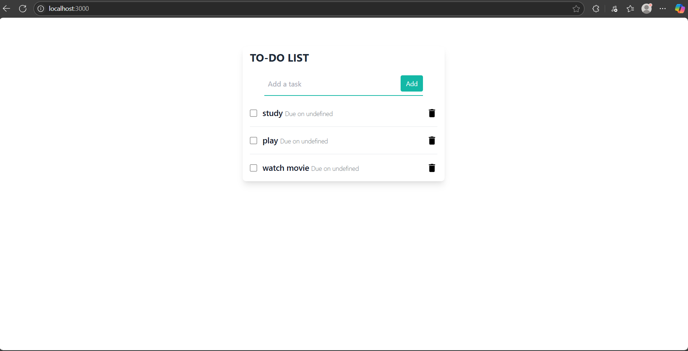

# 📝 Real-Time Todo App using Socket.IO, MongoDB & EJS

A real-time Todo List application built with **Node.js**, **Express**, **Socket.IO**, **MongoDB**, and **EJS** templating. The app allows users to add todos, mark them as completed, and delete them — all with real-time updates using WebSockets.

## 🚀 Features

- 💬 Real-time communication using **Socket.IO**
- 🧾 Add new todos and store them in **MongoDB**
- ✅ Mark todos as **completed** using a checkbox
  - Automatically removed from the visible list upon completion
- ❌ Delete todos instantly
- 🔁 Real-time UI updates across all connected clients
- 📄 Rendered UI using **EJS** templating engine

## 🛠️ Tech Stack

- **Frontend**: EJS, HTML, CSS, JavaScript (Socket.IO client)
- **Backend**: Node.js, Express.js, Socket.IO
- **Database**: MongoDB (with Mongoose)


## 🧪 How it Works

1. When a user adds a todo:
   - It’s stored in MongoDB
   - A `new-todo` event is emitted to all connected clients
2. When a user marks a todo as completed:
   - It’s updated in the DB and removed from the UI
   - A `todo-completed` event is broadcasted
3. When a todo is deleted:
   - It's removed from the DB and the client instantly


## 🛠️ Getting Started

### 1. Clone the repository

```bash
git clone https://github.com/yogendrabaskota/DoSync.git
cd DoSync

```

### 2. Install dependencies
Make sure you have Node.js installed. Then run:
```bash
npm install
```


### 4. Set up environment variables
Create a .env file in the root of your project and add:
``` bash
PORT = PORT_NUMBER
CONNECTION_STRING = MongoDB_CONNECTION_STRING 

```


### 5. Run the development server
```bash
npm start
```


## Project Structure
```bash
src/
│
├── config/
│   ├── config.ts       
│   └── db.ts  
│
├── controllers/
│   └── todoControllers.ts        
│
├── models/
│   └── todoModels.ts            
│       
├── types/
│   └── todoTypes.ts
│
├── views/
│   └── home.ejs
│
├── App.ts                             
├── server.ts                 
└── package.json
```


## Output :
- Home Page:



## Feedback
  If you have any feedback, please reach out to me at yogendrabaskota18@gmail.com  


